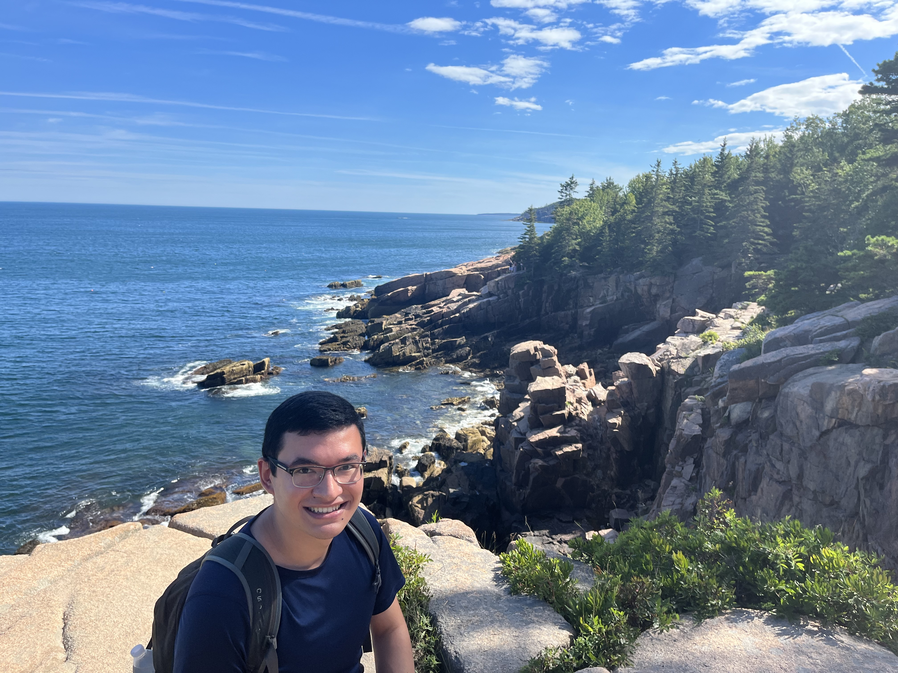

## Education

**Columbia University** Mailman School of Public Health, New York, NY (Expected: 2023-2028)

- First-Year PhD Student in the Department of Environmental Health Sciences

- Fall 2023 Rotation under Dr. Allison Kupsco:
  - Superfund Research Program, Metals and Health 

**Yale School of the Environment**, New Haven, CT (Diploma: May 2022)

- Master of Environmental Management Degree: People, Equity, and Environment Specialization

- Focusing on Political Ecology, Environmental Justice, Community-led Science and Policy Programs.

- Co-lead “Environmental Justice at Yale” (EJAY) Student Interest Group as an Event Facilitator.

- Relevant Coursework: 
  - Environmental Law and Policy 
  - Critical Race Theory 
  - Sociology of Sacred Values
  - Power, Knowledge, and the Environment Research Seminar

**Yale University**, New Haven, CT (Diploma: May 2020)

• Bachelor of Science Degree: Double Major in Environmental Studies & American Studies, *cum laude*

## Previous Research Projects and Publications

**Yale School of Public Health**, 2023, Co-Author:

"Assessment of children's personal and land use
regression model-estimated exposure to NO2 in Springfield, Massachusetts." *Science of The Total
Environment* (2023): 164681. https://doi.org/10.1016/j.scitotenv.2023.164681

**UC Berkeley Dept. Environmental Engineering**, 2019, Collaborator:

"Project Vulcano - Statistical Spatiotemporal Analysis of California Wildfires.”

**SIT Study Abroad Independent Research**, 2018, Author:

"Sediment deposition within two Thalassia testudinum seagrass sites in Boca del Drago, Bocas del Toro Archipelago, Panamá.” https://digitalcollections.sit.edu/isp_collection/2885/

