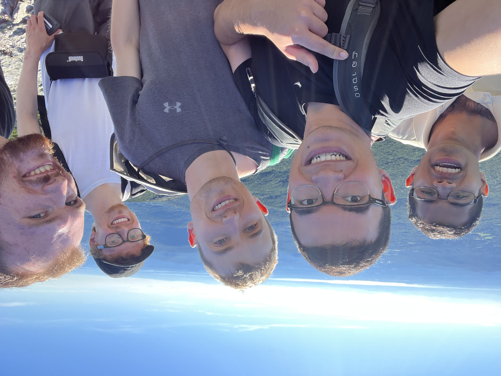

# Welcome

My name is Zander De Jesus, I am a 1st-year PhD student at the Columbia Mailman School of Public Health, Environmental Health Sciences Department. I am most passionate about Environmental Justice Policy, Pollution Remediation, Community-led Field Science, and the History of Social Movements. In particular, making sure we keep a democratic and decolonial lens when we politically organize, to empower all people within our shared communities.

**My Current Projects and Interdisciplinary Research Interests include:**

- Learning the R Language in P8105: Data Science 1 to apply statistical modeling to easily understandable visualizations of Environmental Health Data for public communication.

- Developing Mapping Skills in QGIS Software to understand Air Pollution Exposure.

- Practicing Ethnographic Field Methods in the Race, Climate Change, Environmental Justice Class for community engagement. 

# What is on this site?

This website is currently structured for the P8105 - Data Science Homework 4.

- To learn more about my research background, head over to my [About](about.html) page!

- A [Plotly Project](projects.html) performing Exploratorty Data Analysis on NOAA Weather Monitoring Station Data from NY State.

- A [Dashboard](dashboard.html) containing the interactive graphs produced through this Data Cleaning and Plotly Visualization Work.

